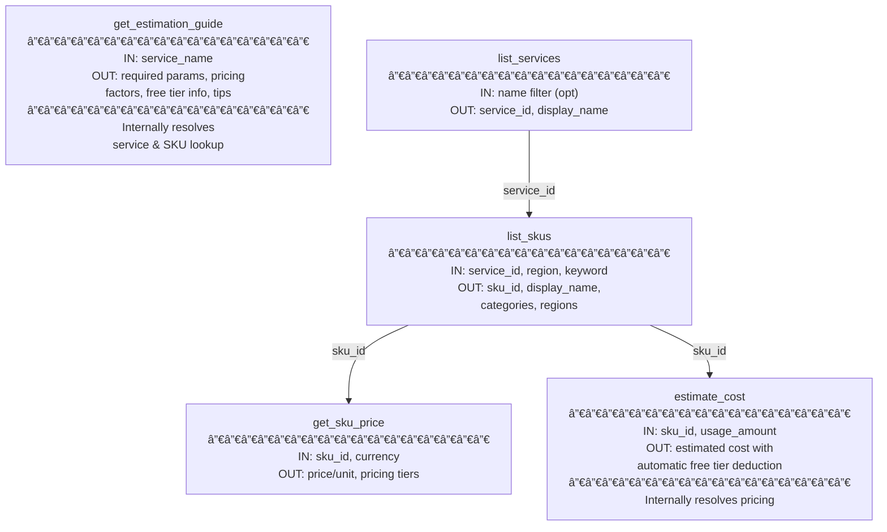
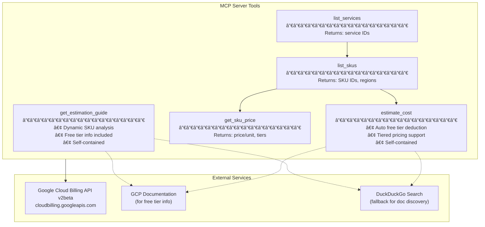

# GCP Cost MCP Server

> **Note**: This is an unofficial project and is not affiliated with, endorsed by, or supported by Google or the Genkit team.


An MCP (Model Context Protocol) server for estimating Google Cloud running costs.

Instead of manually using the [Google Cloud Pricing Calculator](https://cloud.google.com/products/calculator), you can get GCP cost estimates directly from AI assistants like Claude Desktop, Gemini CLI, or Cursor.

## Features

### Available Tools

| Tool | Description |
|------|-------------|
| `get_estimation_guide` | **Start here!** Dynamically generates estimation guides from SKU analysis for any GCP service |
| `list_services` | Lists all available Google Cloud services with their IDs |
| `list_skus` | Lists SKUs (billable items) for a specific service |
| `get_sku_price` | Gets pricing details for a specific SKU |
| `estimate_cost` | Calculates cost based on SKU and usage amount, **with automatic free tier deduction** |

### Tool Relationships

Each tool is **independent and stateless**. AI assistants autonomously decide which tools to call and in what order based on context:



> **Solid arrows** show data flow — one tool's output feeds another's input. `get_estimation_guide` and `estimate_cost` are **self-contained**: they internally resolve their own dependencies, reducing round-trips.

| Use Case | How AI Uses the Tools |
|----------|----------------------|
| **Quick estimate** | `get_estimation_guide` → gather user requirements → `estimate_cost` |
| **Multi-service** | Multiple `get_estimation_guide` + `estimate_cost` calls **in parallel** |
| **Explore pricing** | `list_services` → `list_skus` → `get_sku_price` |
| **Direct calculation** | `estimate_cost` with a known SKU ID |

### Supported Services

`get_estimation_guide` works with **any Google Cloud service**:

- **Dynamic Guide Generation**: Guides are generated dynamically by analyzing SKUs from the Cloud Billing Catalog API
- **Free Tier Information**: Automatically fetched from GCP documentation and included in the guide
- **Universal Coverage**: Works with all GCP services - no hardcoded service list

The tool analyzes available SKUs to determine:
- Required parameters (region, instance type, storage, etc.)
- Pricing factors and billing dimensions
- Free tier quotas (when available)
- Cost optimization tips

## Quick Start

### Prerequisites

- Google Cloud SDK (`gcloud`) installed
- Application Default Credentials configured

> **Note**: No Google Cloud project setup or API enablement is required. This server accesses public pricing data using OAuth authentication.

### 1. Set up Authentication

```bash
gcloud auth application-default login
```

### 2. Install

Choose the installation method that best fits your environment:

#### Option A: Homebrew (macOS/Linux) — Recommended

The easiest way to install on macOS or Linux:

```bash
brew tap nozomi-koborinai/tap
brew install gcp-cost-mcp-server
```

The binary will be installed to `/opt/homebrew/bin/gcp-cost-mcp-server` (Apple Silicon) or `/usr/local/bin/gcp-cost-mcp-server` (Intel/Linux).

**Upgrading to the latest version:**

```bash
# Update tap to fetch the latest Formula
brew update

# Check the available version
brew info gcp-cost-mcp-server

# Upgrade to the latest version
brew upgrade gcp-cost-mcp-server
```

> **Note**: Always run `brew update` first to ensure you get the latest version. Without it, Homebrew uses cached Formula information.

#### Option B: Download pre-built binary

Download from [GitHub Releases](https://github.com/nozomi-koborinai/gcp-cost-mcp-server/releases) for your platform:

| Binary | Platform | Architecture |
|--------|----------|--------------|
| `gcp-cost-mcp-server-darwin-arm64` | macOS | Apple Silicon (M1/M2/M3/M4) |
| `gcp-cost-mcp-server-darwin-amd64` | macOS | Intel |
| `gcp-cost-mcp-server-linux-amd64` | Linux | x86_64 |
| `gcp-cost-mcp-server-windows-amd64.exe` | Windows | x86_64 |

> **macOS users**: After downloading, remove the quarantine attribute:
> ```bash
> chmod +x gcp-cost-mcp-server-darwin-*
> xattr -d com.apple.quarantine gcp-cost-mcp-server-darwin-*
> ```

#### Option C: Build from source

Requires Go 1.21+:

```bash
git clone https://github.com/nozomi-koborinai/gcp-cost-mcp-server.git
cd gcp-cost-mcp-server
go build -o gcp-cost-mcp-server .
```

### 3. Configure Your MCP Client

Find your binary path first:

```bash
# If installed via Homebrew
which gcp-cost-mcp-server
# Output: /opt/homebrew/bin/gcp-cost-mcp-server (Apple Silicon)
#         /usr/local/bin/gcp-cost-mcp-server (Intel/Linux)
```

#### Claude Desktop

Add to `~/Library/Application Support/Claude/claude_desktop_config.json`:

```json
{
  "mcpServers": {
    "gcp-cost": {
      "command": "/opt/homebrew/bin/gcp-cost-mcp-server"
    }
  }
}
```

#### Cursor

Add to `.cursor/mcp.json` in your project or global config:

```json
{
  "mcpServers": {
    "gcp-cost": {
      "command": "/opt/homebrew/bin/gcp-cost-mcp-server"
    }
  }
}
```

#### Gemini CLI

Add to `~/.gemini/settings.json`:

```json
{
  "mcpServers": {
    "gcp-cost": {
      "command": "/opt/homebrew/bin/gcp-cost-mcp-server"
    }
  }
}
```

> **Note**: Replace `/opt/homebrew/bin/gcp-cost-mcp-server` with your actual binary path if different.

## Usage Examples

### Basic Cost Estimation (Conversational)

Start with a simple question - the AI will guide you through the details:

```
You: "How much would Cloud Run cost for 2 instances?"

AI: "To estimate Cloud Run costs accurately, I need a few more details:
    - Region: Where will this be deployed? (e.g., asia-northeast1, us-central1)
    - vCPU: How many vCPUs per instance? (e.g., 1, 2, 4)
    - Memory: How much memory per instance? (e.g., 1 GiB, 2 GiB)
    - Billing type: Instance-based or request-based?
    - Monthly usage: Will it run 24/7 (730 hours) or less?"

You: "Tokyo region, 1 vCPU, 2GB memory, instance-based, 24/7"

AI: "Based on your requirements for 2 Cloud Run instances in Tokyo (asia-northeast1):

    📊 Cost Breakdown:
    - vCPU: 2 vCPU × 2,628,000 sec = 5,256,000 vCPU-seconds
      Free tier applied: -180,000 vCPU-seconds
      Billable: 5,076,000 vCPU-seconds × $0.000024 = $121.82/month
    
    - Memory: 4 GiB × 2,628,000 sec = 10,512,000 GiB-seconds
      Free tier applied: -360,000 GiB-seconds
      Billable: 10,152,000 GiB-seconds × $0.0000025 = $25.38/month
    
    💰 Total estimated: ~$147.20/month (free tier already applied)
    
    💡 Tip: Cloud Run's free tier (180,000 vCPU-sec + 360,000 GiB-sec/month) 
       has been automatically deducted from your estimate."
```

### Explore Services and SKUs

```
You: "What's the service ID for Compute Engine?"
You: "List the available SKUs for Compute Engine in Tokyo region"
You: "How much would an n2-standard-4 instance cost for 730 hours?"
```

### Any GCP Service

All services work with dynamic guide generation:

```
You: "How much would Vertex AI cost for my ML training?"

AI: "I'll generate an estimation guide for Vertex AI by analyzing available SKUs...
    
    Based on my analysis, to estimate Vertex AI costs, I need:
    1. Region: Where will training run?
    2. Machine type: What accelerator type? (e.g., NVIDIA T4, A100)
    3. Training hours: How long will training take?
    4. Storage: How much training data?
    
    Free tier note: Vertex AI offers $300 in free credits for new users.
    
    Would you like me to list the specific SKUs available for Vertex AI?"
```

### Architecture Diagram Estimation (Multi-Service)

Upload an architecture diagram and get a complete cost breakdown:

```
You: [Upload architecture diagram image]
     "Please estimate the monthly cost for this architecture"

AI: "I've analyzed your architecture diagram. Here are the GCP services identified:
     - Cloud Run (Application layer)
     - Cloud SQL (Database)
     - Cloud Storage (Static files)
     - Cloud Load Balancing (Traffic distribution)
     
     To provide an accurate estimate, I need some details:
     
     🌠Common Settings:
     - Region: Is asia-northeast1 (Tokyo) okay?
     
     📦 Cloud Run:
     - vCPUs: 1? 2? 4?
     - Memory: 1GB? 2GB? 4GB?
     - Instance count: How many instances?
     - Uptime: 24/7 or specific hours only?
     
     ðŸ—„ï¸ Cloud SQL:
     - Database type: MySQL? PostgreSQL?
     - Machine type: Dev (db-f1-micro)? Production (db-custom-2-4096)?
     - Storage: How many GB needed?
     - High Availability (HA): Required?"

You: "Tokyo region, Cloud Run with 1vCPU/2GB × 2 instances running 24/7,
      Cloud SQL PostgreSQL db-custom-2-4096, 100GB SSD with HA,
      Cloud Storage 50GB Standard"

AI: "Thank you! Here's your estimate (free tiers automatically applied):

     | Service            | Configuration                  | Monthly Cost |
     |--------------------|--------------------------------|--------------|
     | Cloud Run          | 2 × 1vCPU × 2GB (24/7)         | $147.20 ✨   |
     | Cloud SQL          | PostgreSQL, 2vCPU/4GB, 100GB HA| $178.50      |
     | Cloud Storage      | 50GB Standard                  | $0.00 ✨     |
     | Cloud Load Balancing| Base + traffic                | $18.00       |
     | **Total**          |                                | **$343.70**  |
     
     ✨ = Free tier applied
     
     💡 Cost Optimization Tips:
     - Cloud Run: Set min instances to 0 to reduce idle costs
     - Cloud SQL: Disable HA for ~50% savings (dev environments)
     - Consider 1yr/3yr Committed Use Discounts (CUDs) for up to 57% off"
```

This workflow:
1. AI analyzes the architecture diagram to identify GCP services
2. AI asks about shared parameters (region) first, then service-specific details
3. AI calculates costs for each service using the MCP tools
4. AI presents a consolidated breakdown with total and optimization tips

## Authentication Options

### Using Application Default Credentials (Recommended)

This is the simplest option for personal use:

```bash
gcloud auth application-default login
```

### Using a Service Account

For production or automated environments, use a service account:

```json
{
  "mcpServers": {
    "gcp-cost": {
      "command": "/path/to/gcp-cost-mcp-server",
      "env": {
        "GOOGLE_APPLICATION_CREDENTIALS": "/path/to/service-account.json"
      }
    }
  }
}
```

**Required IAM Role** (only for custom/contract pricing):
- `roles/billing.viewer` (Billing Account Viewer)

> For public pricing data, no IAM roles are required.

---

## Architecture

### Project Structure

```
gcp-cost-mcp-server/
├── main.go                      # Entry point, tool registration
├── internal/
│   ├── freetier/                # Free tier information retrieval
│   │   ├── service.go           # FreeTierService with 24h cache
│   │   ├── search.go            # DuckDuckGo search client
│   │   ├── scraper.go           # GCP documentation scraper
│   │   └── patterns.go          # Regex patterns for extraction
│   ├── pricing/
│   │   └── client.go            # Cloud Billing Catalog API client
│   ├── tools/
│   │   ├── get_estimation_guide.go  # Dynamic guide generator
│   │   ├── estimate_cost.go         # Cost calc + free tier
│   │   ├── list_services.go
│   │   ├── list_skus.go
│   │   └── get_sku_price.go
│   └── mcp/
│       └── server.go            # MCP server wrapper
```

### Tool Design



### Data Flow


### Key Components

| Component | Description |
|-----------|-------------|
| **get_estimation_guide** | Dynamically generates guides by analyzing SKUs from Cloud Billing API. Includes free tier information fetched from GCP documentation. |
| **list_services** | Queries the Cloud Billing API for all available services. Returns service IDs needed to query SKUs. |
| **list_skus** | Lists SKUs for a specific service. Filterable by region and category. |
| **get_sku_price** | Gets detailed pricing for a specific SKU. Supports multiple currencies (USD, JPY, EUR, etc.). |
| **estimate_cost** | Calculates final cost with automatic free tier deduction. Handles tiered pricing calculations. |
| **FreeTierService** | Fetches free tier information via DuckDuckGo search + GCP doc scraping. Caches results for 24 hours. |

---

## Development

### Build

```bash
go build -o gcp-cost-mcp-server .
```

### Test

```bash
# Run all tests
go test -v ./...

# With coverage
go test -cover ./...
```

### Test with MCP Inspector

```bash
npx @modelcontextprotocol/inspector ./gcp-cost-mcp-server
```

### Cross-compile

```bash
# macOS (Apple Silicon)
GOOS=darwin GOARCH=arm64 go build -o dist/gcp-cost-mcp-server-darwin-arm64 .

# macOS (Intel)
GOOS=darwin GOARCH=amd64 go build -o dist/gcp-cost-mcp-server-darwin-amd64 .

# Linux (x86_64)
GOOS=linux GOARCH=amd64 go build -o dist/gcp-cost-mcp-server-linux-amd64 .

# Windows (x86_64)
GOOS=windows GOARCH=amd64 go build -o dist/gcp-cost-mcp-server-windows-amd64.exe .
```

### Release Process

Releases are automated via [GoReleaser](https://goreleaser.com/) and GitHub Actions.

**To create a new release:**

```bash
# 1. Create and push a tag
git tag v0.6.0
git push origin v0.6.0
```

This will automatically:
1. Build binaries for all platforms (darwin/linux/windows, amd64/arm64)
2. Create a GitHub Release with changelog
3. Update the [homebrew-tap](https://github.com/nozomi-koborinai/homebrew-tap) Formula

**Prerequisites for homebrew-tap automation:**
- A GitHub Personal Access Token (PAT) with `repo` scope
- Store it as `HOMEBREW_TAP_TOKEN` in repository secrets

### Local Development

```bash
# Build
go build -o gcp-cost-mcp-server .

# Run locally
./gcp-cost-mcp-server

# Test GoReleaser config (dry run)
goreleaser release --snapshot --clean
```

## Why Genkit for Go?

This MCP server is built with [Genkit for Go](https://github.com/firebase/genkit/tree/main/go) rather than using the raw [mcp-go](https://github.com/mark3labs/mcp-go) library directly. Here's why:

### Type-Safe Tool Definitions

Genkit automatically generates JSON schemas from Go struct tags, eliminating manual schema definitions:

```go
// Genkit: Type-safe with auto-generated schema
genkit.DefineTool(g, "list_skus", "Lists SKUs for a service",
    func(ctx *ai.ToolContext, input struct {
        ServiceID string `json:"service_id" jsonschema_description:"The service ID"`
        PageSize  int    `json:"page_size,omitempty"`
    }) (*Output, error) {
        // Implementation
    })
```

### Automatic MCP Bridge

Genkit's MCP plugin automatically discovers tools from the registry and converts them to MCP format—no manual registration required.

### Unified Ecosystem

| Feature | Benefit |
|---------|---------|
| **Genkit UI** | Debug and test tools visually during development |
| **Tracing** | Automatic execution tracing and observability |
| **AI Model Integration** | Seamlessly connect with Gemini, Bedrock, OpenAI |
| **MCP Host** | Consume other MCP servers in the same codebase |

### Tool Interruption Support

Genkit's `ToolContext` provides interrupt/resume capabilities for long-running operations—useful for user confirmation flows.

### Future-Proof

The same tool definitions work as:
- MCP Server tools (for Claude Desktop, Cursor, Gemini CLI)
- Genkit Flow components (for AI agent workflows)
- HTTP API endpoints (via `genkit.Handler`)

For more details, see the [Genkit MCP Plugin documentation](https://github.com/firebase/genkit/tree/main/go/plugins/mcp).

## License

MIT License
